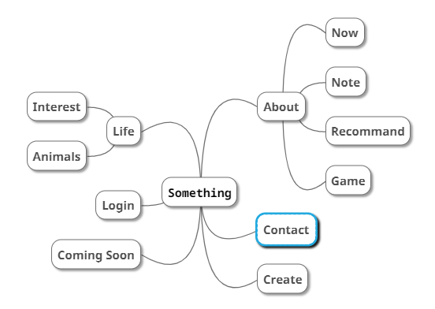

## Wp109b 網頁設計期末書面報告

# 繳交版本心智圖:

# Sourse:
網頁模板大多參考自https://www.w3schools.com/default.asp ，再更改部分程式碼與修改美編。
Contact頁面排版理念參考自https://templated.co/p/4078153616677877。
Life與Login頁面是基於https://blog.csdn.net/weixin_45748460/article/details/106286100?utm_medium=distribute.pc_relevant.none-task-blog-baidujs_title-1&spm=1001.2101.3001.4242 與https://blog.csdn.net/jl244981288/article/details/47126409?utm_medium=distribute.pc_relevant.none-task-blog-baidujs_utm_term-0&spm=1001.2101.3001.4242 的程式碼去做整體的修改，前者讓原本在按鈕邊的動畫改成在背景移動，後者只有留下背景動畫，其餘元件(包含背景動畫的位置)皆有所更改。
進入Animals後，有使用程式碼http://www.uxys.com/html/CSS3/20141017/21427.html 做修改實現三角形排列圖片做出選單區塊，再做美工與排版。

# 有先看過各網站的授權，但若仍有冒犯，深感抱歉，請告知我，我會將其撤下。

# 心得:
此次報告在收尾階段讓我深刻體會到我JavaScript的部分有多處不熟練，無法像HTML與CSS一樣至少知道自己該下甚麼指令或是能自由的更改自己想改的部分參數，這份報告著重在HTML與CSS和其動畫上，Javascript只有部分的輔助。模版方面，更動的地方多是在閱讀完網頁設計流行趨勢相關文章後，對於自己喜歡或認同的部分做模板的更動，加入自己的元素。撇除掉JavaScript小遊戲(不知道我最後做出完整版的貪食蛇了沒QAQ)之外，花費時間最多的就是排版與增加動畫，特別是在進入Animal後，各種我身邊的動物們選單，那個部份我花了很多時間去做調整與修改，其他部分的動畫不曉得是不是因為經過三角選單的地獄之後，所以稍微覺得比較好掌握。這學期的時間大多花在研究怎麼做出喜歡的排版跟研究顏色的搭配還有動畫上，也有整理出上課以外蒐集到一些可以學到更多網站設計的教學，希望可以更明確找到自己喜歡的風格，並運用在動畫跟之後的設計上。JavaScript掌握的只有比較基礎的題目(看我平常練習筆記就會發現)，比較進階的題目有時候要看其他人的程式碼之後才比較有想法，寫程式的思路也比以前稍微清晰一點，雖然平常寫程式我都想很久才開始寫...，最後，小遊戲的部分我選擇將遊戲改成猜數字，這個小遊戲在另一門課有使用C#寫過，想說至少自己能再使用JavaScript重寫一次，複習一下自己的程式邏輯，遊戲2則是這幾天在這幾天研究的小遊戲，還沒完全研究徹底，但對JavaScript有更深一層認識。在本學期分數評分完後，這個網頁與github的筆記仍然會不斷修正與更新。ps.)我再也不要一學期修25學分了...時間根本不夠用嗚嗚嗚嗚・゜・(PД`q｡)・゜・
